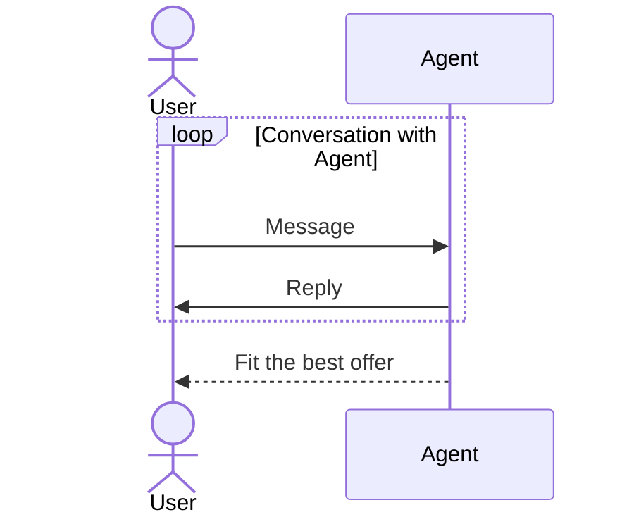
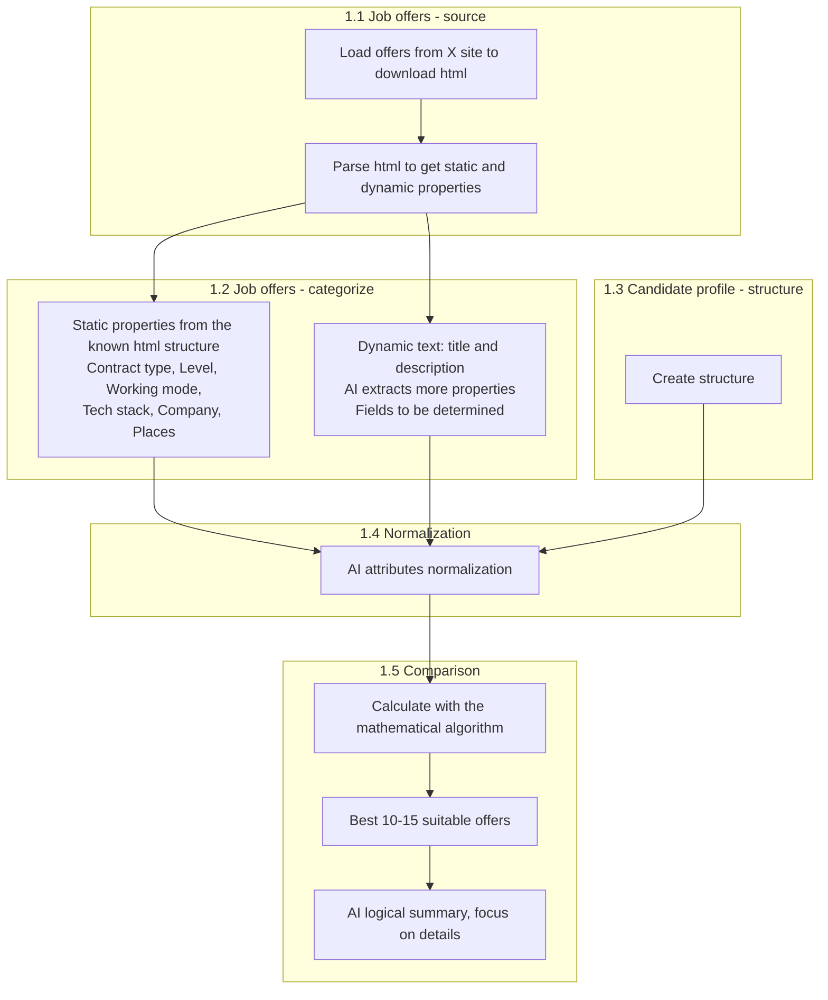
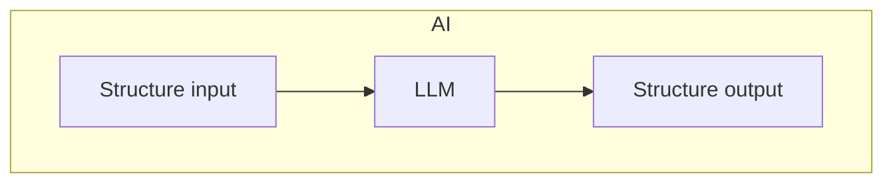

Create an application to find the best suitable job offer for candidate

USER PERSPECTIVE
Phase 1
User manually put all the information in the form. In the result, get the most suitable offers.


Phase 2
User upload its own CV and get the most suitable offers.


Phase 3
User make a conversation with Agent to fit the best offer.




TECHNICAL DETAILS

Phase 1

1.1 Job offers - source

- Load offers from X site to download html files (Scraper)
- Parse html to get static and dynamic properties (Parser)

1.2 Job offers - categorize

- Categorize static properties from the known html structure ex
  - Contract type (ex permanent)
  - Level (ex Junior, Senior)
  - Working mode (ex Remote, Hybrid)
  - List of tech stack (ex .Net, Angular)
  - Company
  - List of places (cities)
- Categorize dynamic text (title and description) to use LLM to extract more properties
To be determined which exactly fields!

1.3 Candidate profile - structure

- Create structure

1.4 Normalization

- Normalize categories with AI so the same concept uses one name
  - Tech stack (ex .Net, .NET C#, C# → .NET)
  - Contract type, level, working mode, places, and other extracted properties
- Apply the same vocabulary to offer properties and the candidate profile

1.5 Comparison

- calculate math based on the mathematical algoritm
- For the best 10-15 suitable offers run LLM to create logical summary and focus on details






AI TESTS

Release tests answer a production question: is this model safe to ship for skill extraction? `JobSeek.Prompter.Services.ReleaseTests` sends real offer text through `AttributesOfferService` and checks the skills that come back. The model is `LLM_MODEL`. When that variable is missing, the run uses `gpt-4o-mini`. Each model writes its own card under `Tests/JobSeek.Prompter.Services.ReleaseTests/leaderboard/`.

The checks are split the way a go-live decision is split. A failed Must have or Should have check means the model is not ready to push. A failed Nice to have check is a known limit, not by itself a reason to block the release.

- **Must have.** The result is safe to store. The offer id comes back, a skill already tagged on the offer keeps that name, level, and list, and a technology named in the offer lands on required or nice-to-have. A miss here would rank candidates against the wrong skills.
- **Should have.** The result stays technical. Benefits, soft traits, and spoken languages stay out. A skill that is only named is not treated as senior. A technology that was not pre-tagged is still extracted. A miss here would show junk skills or overstate seniority in the product.
- **Nice to have.** The wording is harder. Levels follow phrases such as "senior expert" and "basic". Polish text comes back as English technical names. A plus-item stays on the nice-to-have list. Negation, a static tag, and a long offer with many buried skills stay distinct. A miss here means a difficult offer is incomplete. The model can still go to production when Must have and Should have pass.

Every test carries a criterion id and a sentence, for example `NH-06` / "A buried .NET offer yields at least 50 required skills". The row in the card is that sentence. The C# method name stays in the code.

This layout has four practical effects.

- A normal `dotnet test` stays offline. `JobSeek.runsettings` excludes `TestCategory=Llm`, because these calls spend tokens and can change when the model changes.
- Two models are compared on the same ids. Must have and Should have show whether the model is fit to ship. Nice to have shows where a smaller model gives up.
- A failure names the rule. The card says which criterion failed, and the group total says whether the miss blocks production or only marks a harder case.
- The latest run of one model replaces only that model's file. `summary.md` keeps one row per model.

Run a model with:

```powershell
$env:LLM_MODEL = "gpt-4o-mini"
dotnet test Tests/JobSeek.Prompter.Services.ReleaseTests --filter "TestCategory=Llm"
```

`OPENAI_JOBSEEK_API_KEY` must be set. Change `LLM_MODEL` and run again to add another card.

Both models are ready on the production gate: every Must have and Should have check passed. They are not a full pass. `gpt-4o-mini` misses only the buried 50-skill offer (`NH-06`, 15/16). `gpt-4.1-nano` misses that offer and the negation / static-list case (`NH-05`, 14/16). On these runs, `gpt-4o-mini` is the stronger choice to ship, with one known gap on very dense offers.

# 🏆 Leaderboard Card: JobSeek-Attributes-gpt-4o-mini

Run: 2026-10-07 17:25 UTC

## Must have

| ID | Success criterion | Result (Passed/Total) | Status |
|---|---|---|---|
| MH-01 | Offer id is returned in the schema | 1/1 | ✅ PASS |
| MH-02 | Static required skill keeps its name and level | 1/1 | ✅ PASS |
| MH-03 | Static nice-to-have skill stays on its list | 1/1 | ✅ PASS |
| MH-04 | An untagged technology goes to required | 1/1 | ✅ PASS |
| MH-05 | An untagged technology goes to nice-to-have | 1/1 | ✅ PASS |
| MH-06 | Static level wins over the description | 1/1 | ✅ PASS |
| | **Must have** | **6/6** | ✅ PASS |

## Should have

| ID | Success criterion | Result (Passed/Total) | Status |
|---|---|---|---|
| SH-01 | Benefits, soft skills, and spoken languages are dropped | 1/1 | ✅ PASS |
| SH-02 | An untagged technical skill is still extracted | 1/1 | ✅ PASS |
| SH-03 | A named-only skill is not treated as senior | 1/1 | ✅ PASS |
| SH-04 | An English requirements section extracts the technology | 1/1 | ✅ PASS |
| | **Should have** | **4/4** | ✅ PASS |

## Nice to have

| ID | Success criterion | Result (Passed/Total) | Status |
|---|---|---|---|
| NH-01 | Senior-expert wording is level 4 | 1/1 | ✅ PASS |
| NH-02 | A Polish description uses English technical names | 1/1 | ✅ PASS |
| NH-03 | A long description yields the required skills | 1/1 | ✅ PASS |
| NH-04 | A plus-item stays on the nice-to-have list | 1/1 | ✅ PASS |
| NH-05 | Negation, levels, and the static list stay distinct | 1/1 | ✅ PASS |
| NH-06 | A buried .NET offer yields at least 50 required skills | 0/1 | ❌ FAIL |
| | **Nice to have** | **5/6** | ❌ FAIL |

**Total** 15/16 ❌ FAIL

# 🏆 Leaderboard Card: JobSeek-Attributes-gpt-4.1-nano

Run: 2026-10-07 17:28 UTC

## Must have

| ID | Success criterion | Result (Passed/Total) | Status |
|---|---|---|---|
| MH-01 | Offer id is returned in the schema | 1/1 | ✅ PASS |
| MH-02 | Static required skill keeps its name and level | 1/1 | ✅ PASS |
| MH-03 | Static nice-to-have skill stays on its list | 1/1 | ✅ PASS |
| MH-04 | An untagged technology goes to required | 1/1 | ✅ PASS |
| MH-05 | An untagged technology goes to nice-to-have | 1/1 | ✅ PASS |
| MH-06 | Static level wins over the description | 1/1 | ✅ PASS |
| | **Must have** | **6/6** | ✅ PASS |

## Should have

| ID | Success criterion | Result (Passed/Total) | Status |
|---|---|---|---|
| SH-01 | Benefits, soft skills, and spoken languages are dropped | 1/1 | ✅ PASS |
| SH-02 | An untagged technical skill is still extracted | 1/1 | ✅ PASS |
| SH-03 | A named-only skill is not treated as senior | 1/1 | ✅ PASS |
| SH-04 | An English requirements section extracts the technology | 1/1 | ✅ PASS |
| | **Should have** | **4/4** | ✅ PASS |

## Nice to have

| ID | Success criterion | Result (Passed/Total) | Status |
|---|---|---|---|
| NH-01 | Senior-expert wording is level 4 | 1/1 | ✅ PASS |
| NH-02 | A Polish description uses English technical names | 1/1 | ✅ PASS |
| NH-03 | A long description yields the required skills | 1/1 | ✅ PASS |
| NH-04 | A plus-item stays on the nice-to-have list | 1/1 | ✅ PASS |
| NH-05 | Negation, levels, and the static list stay distinct | 0/1 | ❌ FAIL |
| NH-06 | A buried .NET offer yields at least 50 required skills | 0/1 | ❌ FAIL |
| | **Nice to have** | **4/6** | ❌ FAIL |

**Total** 14/16 ❌ FAIL


