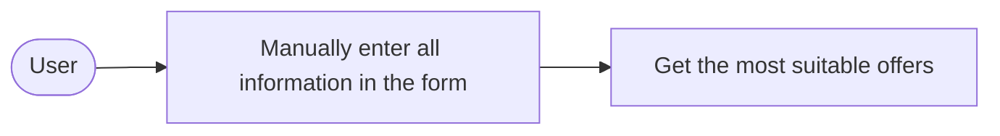
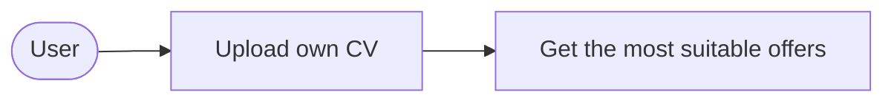
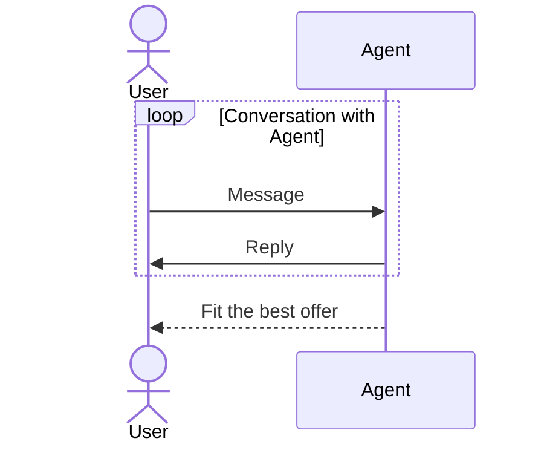
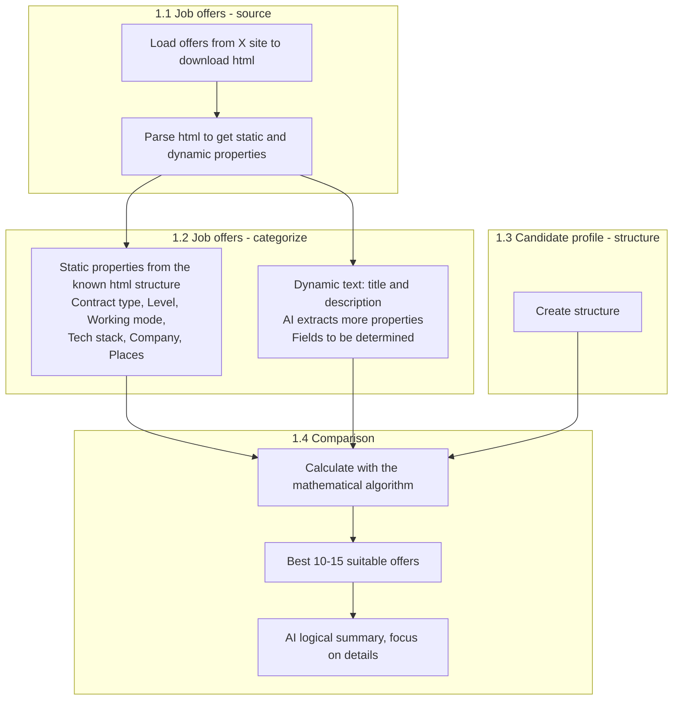
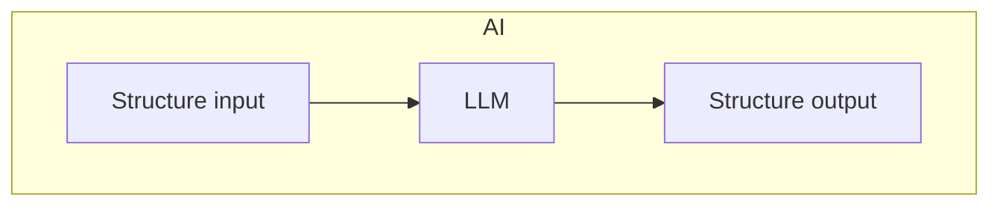

Create an application to find the best suitable job offer for candidate

USER PERSPECTIVE
Phase 1
User manually put all the information in the form. In the result, get the most suitable offers.

Phase 2
User upload its own CV and get the most suitable offers.

Phase 3
User make a conversation with Agent to fit the best offer.

TECHNICAL DETAILS

Phase 1

1.1 Job offers - source
- Load offers from X site to download html
- Parse html to get static and dynamic properties

1.2 Job offers - categorize
- Categorize static properties from the known html structure 
    - Contract type (ex permanent)
    - Level (ex Junior, Senior)
    - Working mode (ex Remote, Hybrid)
    - List of tech stack (ex .Net, Angular)
    - Company
    - List of places (cities)

- Categorize dynamic text (title and description) to use LLM to extract more properties
To be determined which exactly fields!

1.3 Candidate profile - structure
- Create structure 

1.4 Comparison
- calculate math based on the mathematical algoritm
- For the best 10-15 suitable offers run LLM to create logical summary and focus on details

